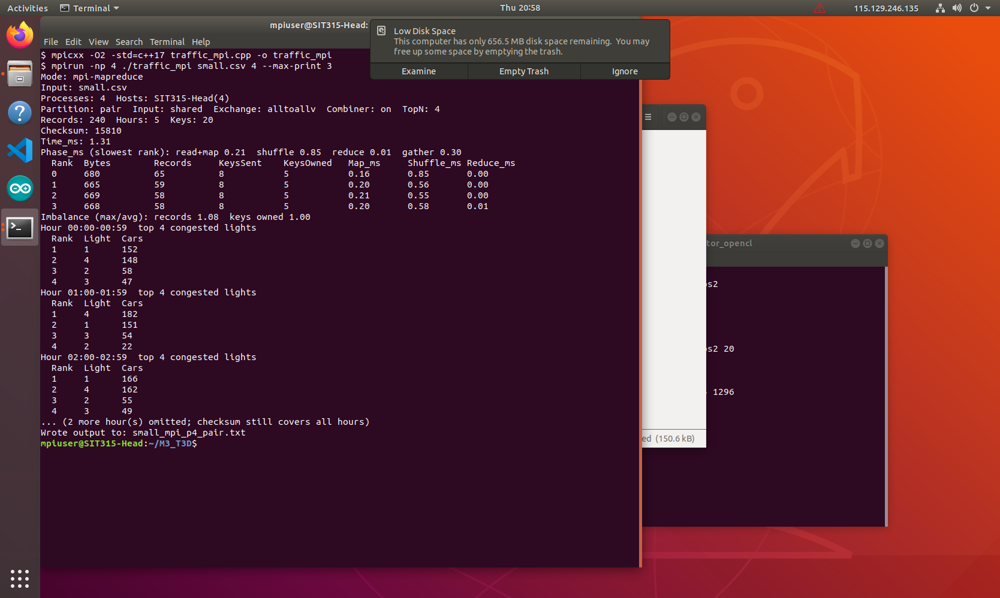
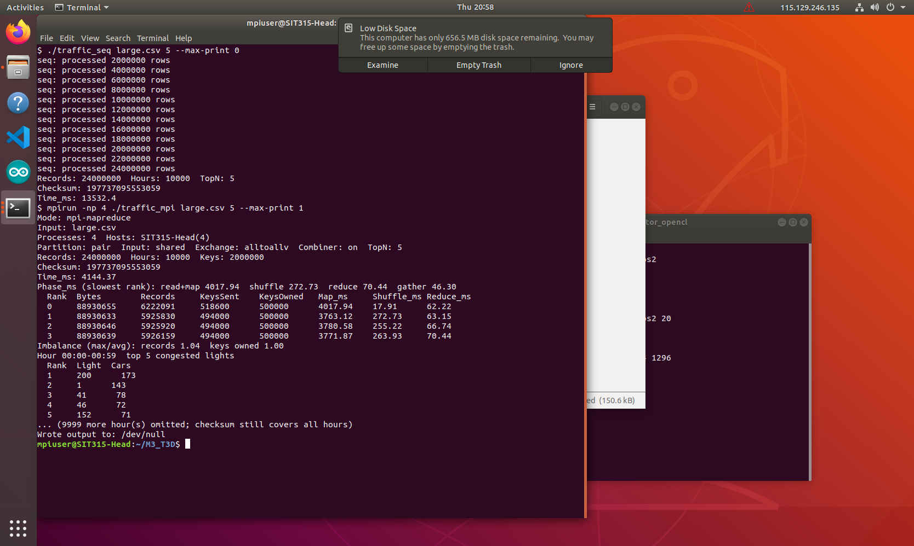
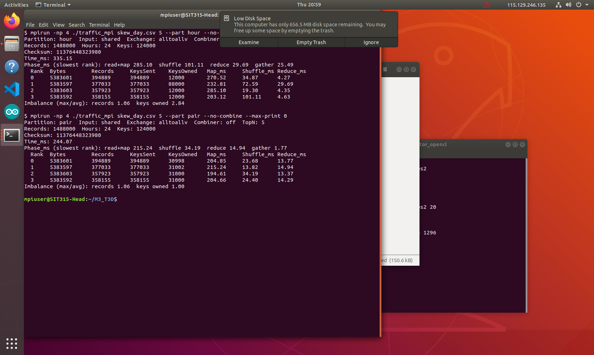

# M3.T3D Traffic Control Simulator — MPI MapReduce Solution Design

## 1. What the program does

`traffic_mpi` reads a traffic file where each line is `timestamp,light_id,cars` (timestamp in minutes, 12 readings per hour, one every 5 minutes). It prints the top N most congested traffic lights for every hour. It is an MPI MapReduce program: every process maps part of the file, the partial totals are shuffled by key between processes, and each process reduces the keys it owns.

Example input (`small.csv`, 4 lights × 5 hours × 12 readings = 240 rows):

```text
0,TL01,23
0,TL02,8
0,TL03,4
0,TL04,23
5,TL01,10
...
```

## 2. How it builds on M2.T3D (`traffic_pc.cpp`)

| M2.T3D producer–consumer | M3.T3D MPI MapReduce |
| --- | --- |
| Producer threads each read a line-aligned byte range of the file | Each MPI rank reads one line-aligned byte range. Rank 0 picks the cuts and broadcasts them, so a rank reads its range with one `read` instead of one `tellg` per line |
| Rows pass through a shared bounded buffer (one mutex, two condition variables) | No shared buffer. Ranks share no memory, so each rank parses its own rows directly. The buffer contention seen in M2 (the `--batch 1` DNF) cannot happen |
| Each consumer fills a private `HourTable`; main merges after `join` | Each rank fills a private `HourTable` (the combiner). The merge is distributed: each `(hour, light)` total is sent to the rank that owns that key |
| Main sorts every hour at the end | Each owner keeps only its local top N per hour (`std::partial_sort`). Rank 0 merges at most P × N candidates per hour |

`traffic_common.hpp` (parser, `HourTable`, `print_top_n`, checksum) and `traffic_seq.cpp` are reused unchanged. The MPI program therefore prints exactly the same top-N text and checksum as the sequential baseline, and the two outputs can be compared with `cmp`.

## 3. Map, Shuffle, Reduce

1. **Split (rank 0 coordinates).** Rank 0 skips a header line if there is one, cuts the file into P equal byte ranges, and moves each cut forward to the next line start. The P+1 offsets are sent with `MPI_Bcast`.
2. **Read.** Two modes:
   - `--input shared` (default): the file is in a folder every rank can read. Each rank reads only its own range.
   - `--input scatter`: only rank 0 opens the file. It reads it and sends each rank its bytes with `MPI_Scatterv`.
3. **Map + combine.** Each rank parses its lines with `parse_line` and adds `cars` into a local `HourTable` keyed by `hour → light`. This combiner turns many rows into one entry per `(hour, light)`. For `large.csv` that is 24,000,000 rows down to 2,000,000 keys.
4. **Partition.** Each local `(hour, light, total)` becomes a fixed 32-byte `KV` record. It goes into bucket `owner(key)`:
   - `--part pair` (default): `FNV1a(hour, light) % P`. Keys spread evenly even when a few hours are very busy.
   - `--part hour`: `FNV1a(hour) % P`. All lights of an hour go to one rank. This is simpler, but a busy hour overloads one rank.

   FNV-1a is used instead of `std::hash` so that ranks on different machines always agree on the owner.
5. **Shuffle (data exchange).** The bucket sizes are swapped with `MPI_Alltoall`. The buckets themselves go through either:
   - `--exchange alltoallv` (default): one blocking `MPI_Alltoallv` call.
   - `--exchange p2p`: non-blocking `MPI_Irecv` / `MPI_Isend` to each other rank. While those messages are in flight, the rank reduces its own bucket, then calls `MPI_Waitall`.

   `KV` is sent as a committed derived datatype (`MPI_Type_contiguous` of 32 bytes).
6. **Reduce.** Each rank adds the received `KV`s into an `owned` `HourTable`. Every `(hour, light)` total is now complete on exactly one rank. For each owned hour the rank keeps its local top N, ordered by cars descending then light id ascending, the same order as `print_top_n`.
7. **Final merge.** Rank 0 collects every rank's candidates with `MPI_Gather` + `MPI_Gatherv` and prints them with `print_top_n`. This is correct because each `(hour, light)` total lives on only one rank. The global top N of an hour is therefore always inside the union of the per-rank top N lists. A second gather carries `Σ light × cars` per hour, from which rank 0 rebuilds the same checksum as `traffic_seq`.

`--no-combine` skips step 3's combining and sends every row as its own `KV`. It exists to measure message cost.

## 4. Data structures

| Structure | Where | Why |
| --- | --- | --- |
| `std::vector<uint64_t> cuts` | Split | P+1 byte offsets. Rank 0 fills it, every rank gets it by `MPI_Bcast` |
| `std::string chunk` | Read | This rank's raw bytes. Freed after map |
| `HourTable` = `std::map<std::string, std::unordered_map<int, long long>>` | Map (combiner), Reduce (owned), rank 0 (top) | Ordered by hour for printing, hashed by light for O(1) adds. Same type as M2 |
| `struct KV { char hour[16]; int32 light; int64 cars; }` | Shuffle, gather | Fixed size, so an array of them is sent as one MPI datatype with no text serialising |
| `std::vector<std::vector<KV>> out` | Partition | One bucket per destination rank |
| `std::vector<int>` send/recv counts and displacements | Shuffle, gather | Arguments for `Alltoallv` / `Gatherv` |
| `std::vector<std::pair<long long,int>>` + `partial_sort` | Reduce | Top N per hour without sorting every light |
| `std::map<std::string, uint64_t>` | Rank 0 | Per-hour checksum parts, in hour order |

## 5. Thread safety, blocking and non-blocking

Each MPI process is single-threaded. It only touches its own memory, so there are no locks, atomics or data races. The only shared things are the input file (read-only) and MPI messages. The M2 mutex and condition variables are not needed.

| Operation | Type | Notes |
| --- | --- | --- |
| `MPI_Bcast` cuts | Blocking collective | All ranks wait for rank 0 to finish splitting |
| `MPI_Scatter` / `MPI_Scatterv` (scatter mode) | Blocking collective | Rank 0 reads and sends everything, so it is serial |
| `MPI_Alltoall` counts | Blocking collective | Also acts as a barrier after map. Fast ranks wait here for the slowest mapper |
| `MPI_Alltoallv` buckets | Blocking collective | Default exchange |
| `MPI_Isend` / `MPI_Irecv` + `MPI_Waitall` | Non-blocking point-to-point | `--exchange p2p`. The own-bucket reduce overlaps with the transfer. Send buffers are not touched until `Waitall` returns |
| `MPI_Gather` / `MPI_Gatherv` | Blocking collective | Candidates, checksum parts, per-rank stats, host names |

## 6. Test environment

| Item | Value |
| --- | --- |
| VM | SIT315-Head (VMware Workstation, 4 vCPU, 8 GB) |
| Host CPU | 13th Gen Intel Core i7-13620H (VM sees 4 cores, 1 thread each) |
| RAM | 7.7 GiB, 759 MiB swap |
| OS | Ubuntu 18.04.2 LTS, kernel 5.3.0-62 |
| Compiler / MPI | g++ 7.5.0, MPICH 3.3a2 (Hydra) |
| Build | `mpicxx -O2 -std=c++17 traffic_mpi.cpp -o traffic_mpi` and `g++ -O2 -std=c++17 traffic_seq.cpp -o traffic_seq` |

All runs are on the one head VM (shared-memory MPI transport). `Time_ms` starts after a barrier, before the split. It stops when rank 0 has merged the results. It includes file reading and all messages.

## 7. Level 1 — correctness on a small dataset

`small.csv` (240 rows) can be checked by hand. For hour 0, light 1 has twelve readings summing to 152, light 4 to 148, light 2 to 58 and light 3 to 47.

`run_bench.sh` ran the MPI program with P = 1, 2, 3, 4 × `--part pair|hour` × `--exchange alltoallv|p2p`, which is 16 runs. All 16 printed checksum **15810** and top-N output byte-identical to `traffic_seq` (`logs/check_summary.txt`). `--input scatter --no-combine` with 3 processes also gives 15810.



Every larger run also matched the sequential checksum (`logs/results.csv`): xl 167552348426, medium 16595023395934, large 197737095553059.

## 8. Level 2 — scaling

Three sizes, sequential plus 1–4 processes, 3 repeats each. The table shows the median `Time_ms`. Speedup is against `traffic_seq`.

| Dataset | Rows | Seq ms | P=1 ms | P=2 ms | P=3 ms | P=4 ms | Speedup P=2 | P=3 | P=4 | Efficiency P=4 |
| --- | ---: | ---: | ---: | ---: | ---: | ---: | ---: | ---: | ---: | ---: |
| xl | 691,200 | 374 | 383 | 202 | 146 | 124 | 1.85 | 2.56 | 3.02 | 0.76 |
| medium | 6,912,000 | 3,661 | 3,857 | 1,873 | 1,311 | 1,039 | 1.95 | 2.79 | 3.52 | 0.88 |
| large | 24,000,000 | 12,463 | 13,562 | 6,583 | 4,622 | 3,667 | 1.89 | 2.70 | 3.40 | 0.85 |



Phase breakdown for `large.csv`, P = 4 (`logs/large_p4_combine.txt`):

```text
Phase_ms (slowest rank): read+map 3866.86  shuffle 216.88  reduce 69.96  gather 36.20
  Rank  Bytes        Records     KeysSent    KeysOwned   Map_ms     Shuffle_ms Reduce_ms
  0     88930655     6222091     518600      500000      3866.86    16.80      69.96
  1     88930633     5925830     494000      500000      3667.23    216.88     65.48
  2     88930646     5925920     494000      500000      3715.85    167.44     66.41
  3     88930639     5926159     494000      500000      3698.95    185.18     65.54
```

### Analysis and scaling limits

- **Map dominates.** Read+map is about 95% of the run, and it is CPU-bound parsing that splits perfectly. That is why speedup is close to linear up to the 4 vCPUs. Beyond 4 processes there are no more cores on this VM.
- **P = 1 is 2–9% slower than sequential.** That is the MPI overhead: the chunk is copied into memory, `KV` buckets are built, and the reduce rebuilds the hour table that the map had already built.
- **Message cost.** With the combiner, the shuffle moves 2,000,000 × 32 bytes = 64 MB for the large file, about 5% of the time. Rank 0's final merge and printing are serial (Amdahl). They stay small because rank 0 only receives P × N candidates per hour, not every light.
- **Imbalance from uneven rows per byte.** The split balances bytes, not rows. Timestamps near the start of the file have fewer digits, so rank 0 gets about 4–6% more rows (records imbalance 1.04–1.06). The other ranks then wait for rank 0 inside `MPI_Alltoall`. Their larger `Shuffle_ms` (167–217 ms against 17 ms on rank 0) is mostly that waiting. This, plus the OS and `mpirun` sharing the same 4 cores, is why efficiency is 0.85–0.88 instead of 1.0.
- **Small inputs scale worse.** xl only reaches 3.02×, because process start-up and collectives are a fixed cost of a few milliseconds against a 124 ms run.

## 9. Level 3 — uneven keys, uneven partitions and bottleneck choices

### 9.1 Uneven key split (skewed data)

`data_gen ... skew` makes 08:00 and 17:00 carry every light while the other hours have 1 in 20. The keys per hour are therefore very uneven.

| Run (P=4 unless noted) | Partition | Keys owned per rank | Keys imbalance | Reduce ms (slowest) | Gather ms | Time ms |
| --- | --- | --- | ---: | ---: | ---: | ---: |
| `skew.csv` | hour | 31000 / 50000 / 31000 / 12000 | 1.61 | 3.85 | 2.25 | 289 |
| `skew.csv` | pair | 30999 / 30999 / 31001 / 31001 | 1.00 | 2.16 | 0.17 | 236 |
| `skew.csv`, P=3 | hour | — | 1.81 | 5.61 | 3.76 | 336 |
| `skew.csv`, P=3 | pair | — | 1.00 | 3.63 | 0.10 | 302 |
| `skew_day.csv`, no combiner | hour | 12000 / 88000 / 12000 / 12000 | 2.84 | 33.69 | 28.79 | 305 |
| `skew_day.csv`, no combiner | pair | 30998 / 31002 / 31000 / 31000 | 1.00 | 23.06 | 1.71 | 280 |



`skew_day.csv` has only two busy hours, and the hour partitioner happens to hash both to rank 1. That rank owns 71% of the keys, and rank 0 then waits about 29 ms in the gather for it to finish. Partitioning by `(hour, light)` puts each key independently, so even one huge hour is spread across all ranks. The top N stays correct because each pair total is still complete on one rank (section 3, step 7). Every skew run printed the same checksum as `traffic_seq`.

The total-time gain is modest (about 10–20%) because the combiner already makes reduce cheap and map dominates. The imbalance shows clearly in the per-rank `KeysOwned` and `Reduce_ms` columns. It would grow with more lights per hour or a heavier reduce step.

### 9.2 Uneven partitions of the input

- Row counts that are not divisible by P (for example P = 3) are handled by the byte split, which never needs equal counts. Records imbalance stays at 1.04–1.06 for every P.
- Cuts are moved to line starts, so no row is split or counted twice. An empty range, when P is larger than the number of lines, is also valid.

### 9.3 Design choices that reduce bottlenecks

| Choice | Evidence (P=4) |
| --- | --- |
| Combiner before the shuffle | large: 24.0M `KV` sent without it, 2.0M with it. Shuffle + reduce takes 1327 ms without against 287 ms with, and total time is 4809 against 3990 ms. At 72M rows it is 69.3 s without against 13.7 s with, and at 96M rows the run without it was killed (section 10) |
| Shared-file read instead of master scatter | large: `--input scatter` 4543 ms against `shared` 3990 ms. In scatter mode rank 0 reads all 356 MB alone, then sends three quarters of it. Shared mode reads the four ranges in parallel. Scatter mode is limited to 2 GB (MPI `int` counts) and holds the whole file in rank 0's memory |
| `pair` partitioner | Keys imbalance 1.00 against 1.61–2.84 for `hour` (9.1) |
| Local top N before the final gather | Rank 0 receives at most P × N entries per hour, not every light |
| Binary `KV` datatype instead of text | No string building or parsing on either side of the shuffle |
| Non-blocking `p2p` exchange | large: 3674 ms against 3990 ms for `alltoallv`. medium: 1334 against 1223 ms. Within run-to-run noise (`alltoallv` large ranged 3588–4758 ms), because after combining there is little left to overlap |

## 10. Stress test (DNF)

Machine as in section 6: i7-13620H VM with 4 vCPU, 7.7 GiB RAM, 759 MiB swap, Ubuntu 18.04. Logs are in `logs/stress72_*` and `logs/stress96_*`.

| File | Command | Result |
| --- | --- | --- |
| 72M rows, 1.1 GB | `mpirun -np 4 ./traffic_mpi stress.csv 5` | Finished, 13.7 s |
| 72M rows | `timeout -k 10 600 mpirun -np 4 ./traffic_mpi stress.csv 5 --no-combine` | Finished, but took 69.3 s (5× slower). Memory hit 7.7 GB used and the machine was swapping |
| 96M rows, 1.5 GB | `mpirun -np 4 ./traffic_mpi stress.csv 5` | Finished, 21.1 s, checksum 3163647494635508 |
| 96M rows | `timeout -k 10 600 mpirun -np 4 ./traffic_mpi stress.csv 5 --no-combine` | **DNF, out of memory.** After about 33 s the kernel OOM killer killed one rank (`Out of memory: Killed process 11572 (traffic_mpi) ... anon-rss:1934864kB`). `mpirun` reported `BAD TERMINATION ... Killed (signal 9)`, exit 9 |

Reason: without the combiner every row becomes a 32-byte `KV`, and it exists about three times at once (the bucket, the flattened `Alltoallv` send buffer, and the receive buffer). For 96M rows that is about 9 GB, more than RAM plus swap. With the combiner only 8M keys travel, so the same file finishes in 21 s. The test was limited by the VM disk (about 1.7 GB free), which is why the largest file is 1.5 GB.

## 11. Submission checklist

| Item | File |
| --- | --- |
| Design document | `DESIGN.md` (this file) |
| Code | `traffic_mpi.cpp`, `traffic_common.hpp`, `traffic_seq.cpp`, `data_gen.cpp`, `Makefile`, `run_bench.sh` |
| Screenshots | `Evidence/small_run_p4.png`, `Evidence/large_seq_vs_p4.png`, `Evidence/skew_hour_vs_pair.png` |
| Example data file | `small.csv` (others are made with `data_gen`, see README) |
| Run transcripts | `logs/` |
